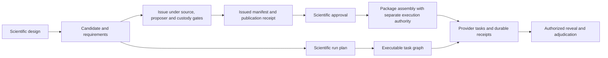

# Architecture

SPDX-License-Identifier: CC-BY-4.0

This guide maps the implemented scientific engine to its source owners.
It locates validation, planning, execution and custody within the researcher workflow.
Use it to find an interface, implementation owner and relevant checks.

The scientific object is the support-limited response relation `L(D,H,A,R,τ)`.
Its operands are the prepared denominator, causally available history, native action chart, receiver and horizon.
The shared engine owns their contracts.
Substrate adapters provide native preparation, delivery and observation.

## Source layers

```text
kernel <- planning <- runtime <- adapters and infrastructure <- API <- CLI
```

Imports point toward the scientific core.
Adapters and infrastructure can compose at their shared layer.
Neither layer imports the API or CLI.
The CLI example entry can import its example implementation.
Other production modules use the native resource owner directly.
The [import-boundary check](../tests/test_import_boundaries.py) includes local and relative imports.

| Owner | Responsibility |
|---|---|
| [Kernel](../src/empirical_lawhood/kernel/) | Scientific records, native units, support, visibility, validation and canonical identities |
| [Planning](../src/empirical_lawhood/planning/) | Design lineage, independent units, prospective cutoffs, authority obligations and source profiles |
| [Runtime](../src/empirical_lawhood/runtime/) | Registries, candidate/plan compilation, provider protocols, scientific services and recovery contracts |
| [Adapters](../src/empirical_lawhood/adapters/) | Native sources, scientific methods, controller bridges and family composition |
| [Infrastructure](../src/empirical_lawhood/infrastructure/) | Bounded I/O, guarded custody, signatures, receipts, local scheduling, source verification and SQLite projection |
| [API](../src/empirical_lawhood/api/) and [CLI](../src/empirical_lawhood/cli/) | Application composition, strict document handoffs and the single installed command |

## Records, lineage and three graphs

Frozen records declare their schema and format revision. Their constructor checks own scientific operands and support limits. [Canonical serialization](../src/empirical_lawhood/kernel/serialization.py) binds exact bytes to identity. [Strict decoding](../src/empirical_lawhood/kernel/decoding.py) rejects invalid shapes, unknown fields and identity substitutions at its declared boundary.

Shared record validation belongs in the kernel. Bounded descriptor reads belong in [infrastructure](../src/empirical_lawhood/infrastructure/bounded_io.py). Family-specific scientific helpers remain with their adapter owner.

The engine keeps three graphs distinct:

| Graph | Object and owner | Meaning |
|---|---|---|
| Scientific lineage | `CampaignSpec` in [campaigns.py](../src/empirical_lawhood/planning/campaigns.py) | Campaign nodes, roots, worlds, active nodes, decision rights and evidence state |
| Scientific operations | `ProtocolRunPlan` in [plans.py](../src/empirical_lawhood/runtime/plans.py) | Authorized scientific steps, source/resource identities and cutoffs |
| Executable tasks | `ProtocolExecutionPlan` in [plans.py](../src/empirical_lawhood/runtime/plans.py) | Concrete capability requirements, inputs, outputs, dependencies, resource locks and barriers |

[Compilation](../src/empirical_lawhood/runtime/compiler.py) constructs the run plan and its executable graph.
[Scientific graph preservation](../src/empirical_lawhood/runtime/scientific_graph_preservation.py) validates their agreement.
A campaign lineage is not a task scheduler.



Each transition has its own typed inputs and gates.
Candidate compilation grants no issue, execution or reveal authority.
An issued package binds the reviewed delivery contract.
The elapsed-budget package adds an immutable cumulative time contract.
[Package assembly](../src/empirical_lawhood/api/models.py) preserves those distinct roles.

## Follow actual objects through a workflow

Start with the [reactor example](../experiments/reactor-response/guide.md):

| Step | Input → object / product | Owner and effect |
|---|---|---|
| Load | Three pinned public inputs → `ReactorSourceBundle` | [Packaged source](../src/empirical_lawhood/adapters/simulators/reactor_prefix_response/packaged_source.py); verifies original digests |
| Measure | Declared branches → `ReactorPrefixEpisode`, then `ReactorPrefixPanel` | [Native panel](../src/empirical_lawhood/adapters/simulators/reactor_prefix_response/panel.py); 20 numerical branches nested under five exposed units |
| Report | Panel and delivery observations → `panel.json`, `report.json`, `report.md` | [Example](../src/empirical_lawhood/examples/reactor_prefix.py); writes only the explicit local destination; a failed branch retains `partial.json` |

This demonstration has no issued campaign, execution receipts or scientific
qualification. Its panel is a typed observation, not an authorization record.

The [assigned reactor procedure](fresh-experiment.md) instead supplies actual
assignment, exposure census, source and authority inputs. Candidate compilation
produces the scientific run plan and executable task plan; separate issue and
approval gates bind them to a published study and execution package. Providers
execute the declared tasks, publish outputs with receipts, and only an authorized
read can expose the resulting adjudication. A lost catalog can be rebuilt from
those authenticated receipts without repeating completed observations.

For a producer-to-method-to-consumer example, follow the
[finite response-law trace](designing-and-running-an-experiment.md). It shows
how current calibration observations become a separately checked forecast input
for the unchanged response package. The scientific lineage, protocol operations
and executable tasks retain their distinct identities at each handoff.

## Discovery and executable reconstruction

Static discovery lists declared capabilities, permissions, configurations and maximum evidence ceilings.
It can report an installed binding without constructing its native provider.
The [route register](substrate-route-register.md) states each family's input, execution and refusal ceiling.
The [generated descriptors](../src/empirical_lawhood/adapters/composition/generated_extension_bundles.py) do not establish scientific readiness.

Executable reconstruction also needs the exact typed records and complete platform-port contract.
[Executable bindings](../src/empirical_lawhood/runtime/executable_bindings.py) join the registered implementation to its factory and input codecs.
[Provider protocols](../src/empirical_lawhood/runtime/providers.py) declare runners, external inputs and output semantics.
Registration alone does not supply the family-specific authoring and custody route.

## Workflow, configuration and operational presentation

[Workflow facts](../src/empirical_lawhood/api/workflows.py) own a closed public workflow catalogue.
[CLI discovery](../src/empirical_lawhood/cli/workflows.py) joins its command references to existing CLI metadata.
The API does not import the CLI. Static discovery opens no inputs and builds no provider.
The [experiment index](../experiments/README.md) renders the same task facts.

[Configuration](configuration.md) resolves allowlisted consumer roles and preserves strict record constructors.
Editor schemas are structural projections. Canonical decoding, Decimal meaning and consumer byte limits remain authoritative.
[Operational attempts](results-and-failures.md) retain optional development diagnostics outside closed scientific packages.
Issued records and receipts retain their existing authority and recovery owners.
The [worked RC trace](extending-the-engine.md#worked-rc-extension) demonstrates the local boundary and its distinct later provider work.

## Current study integration owners

The [integration handoff](../src/empirical_lawhood/api/integration_handoffs.py) selects closed RC, finite-response or preparation handoff schemas.
It validates the four closed family/payload pairs and supplies existing application
composition inputs without another scheduler or arbitrary module lookup.
The neutral [provider proof](../src/empirical_lawhood/api/integration_proof.py)
owns full graph, resource, output and fresh-input checks without importing a family
authoring service or its dispatcher. The neutral
[artifact-profile owner](../src/empirical_lawhood/api/integration_artifact_profiles.py)
preserves the base profiles plus the exact flat float64 array validator.
Family authors and the dispatcher use these same owners.
Family adapters own science and fixed operands.
[Matrix input contracts](../src/empirical_lawhood/kernel/matrix_inputs.py) and [bounded array transport](../src/empirical_lawhood/infrastructure/matrix_array_io.py) serve current source, bridge and readiness consumers.

Editable selections, scientific protocols, environment bindings and immutable evidence have separate typed roles.
Array manifests bind physical bytes, member shapes and scientific source identity.
Current publications and receipts bind those operands to guarded custody.
Configuration validation checks the selected record role without loading arrays or building a native provider.
An input label cannot replace any of these relationships or establish fresh evidence.

The [geometry API](../src/empirical_lawhood/api/matrix_geometry.py) and [selected-event API](../src/empirical_lawhood/api/selected_events.py) compose current source, conformance and descriptive result operations.
The [history API](../src/empirical_lawhood/api/matrix_history_analysis.py) joins shared paired native histories to adapter-owned algebra and passive calculations.
The [preparation analysis API](../src/empirical_lawhood/api/matrix_preparation_analysis.py) reuses existing native projections, mechanical kernels and saved whole-root fits.
The [diagnostic API](../src/empirical_lawhood/api/preparation_diagnostics.py) reads authenticated current preparation results without reacquiring their native observations.
These development routes retain their own completion receipts or manifests.
They create no study grants or scientific qualification.

The shared [numerical provenance boundary](../src/empirical_lawhood/api/matrix_numerical_provenance.py)
checks the selected checkout, dependency lock and actual numerical runtime before
native work. Its [immutable record](../src/empirical_lawhood/kernel/numerical_provenance.py)
binds the complete producing package inventory and observed Git state.
An observed HEAD alongside changed source is recorded as such.
Retained readers validate that producing record without rerunning native work or
requiring the reader to reproduce the producing environment.

[Retained analysis completion](../src/empirical_lawhood/runtime/retained_analysis.py)
declares an exact member census. Its [infrastructure owner](../src/empirical_lawhood/infrastructure/retained_analysis.py)
commits that census through the existing guarded artifact plane and checks each
member before returning a report. Family APIs own metric roles, complete inputs
and outcome consistency. Changing only a terminal report cannot change a retained
scalar or remove an unevaluable outcome.

The shared [native admission helper](../src/empirical_lawhood/adapters/simulators/_native_admission.py)
bounds update counts and estimated retained histories before simulator contact.
TORAX and Brian2 keep their own units, clock rules and scientific reductions.
Operational limits do not establish numerical accuracy or scientific eligibility.

[Authoring codecs](../src/empirical_lawhood/api/codecs.py) reuse equal immutable
typed records within one parse through the shared [parsed-node owner](../src/empirical_lawhood/kernel/parsed_nodes.py).
Every serialized occurrence retains its syntax, node and depth checks.
The parse scope ends before another input or authority read.
When a handoff independently reconstructs a validated record, it checks the
retained file's complete canonical bytes through the bounded I/O owner.
This avoids decoding that same expectation again while preserving fresh source,
publication and authority checks at each public boundary.

[Exact receipt lookup](../src/empirical_lawhood/infrastructure/task_receipts.py) addresses the selected stored run/task/receipt, including an authorized later attempt, without changing retry policy. Current result and parent APIs authenticate full sibling publications and replay persisted issue/execution/reveal grants before protected reads. The shared [current result custody](../src/empirical_lawhood/api/current_result_custody.py) owner also reconstructs the stored issued plans and checks their complete output contracts against the exact receipt; missing controls do not establish an unissued result. Explicit exposed imports retain their own bounded custody contract. Pure authoring proof reconstructs providers, graphs, outputs and resources but creates no authority and executes no scientific tasks. The [researcher integration guide](integrations.md) joins these owners to public commands.

Typed runtime plans have a dedicated 64 MiB bounded reader contract, sized for the complete 64-root forecast graph. Compact controls and receipts retain their 16 MiB limit; campaign packages retain their separate 256 MiB limit. Plan/package semantic replay uses a finite aggregate allowance derived from those input roles, with independent per-file limits still enforced. These capacity bounds change no scientific settings or authority requirements.

## Application composition and module responsibilities

These modules already provide service seams.
Their size alone is not a reason to split them.

| Module | Implemented boundary | Existing verification owner |
|---|---|---|
| [api/facade.py](../src/empirical_lawhood/api/facade.py) | `EmpiricalLawhoodApi` validates requests, delegates compilation/issue/execution and joins catalog/discovery results. Injected services provide effectful operations. | [Catalog facade](../tests/api/test_catalog_facade.py), [campaign API](../tests/api/test_campaign_execution.py), [candidate compilation](../tests/runtime_platform/test_candidate_compiler.py) |
| [api/execution.py](../src/empirical_lawhood/api/execution.py) | `CampaignExecutionService` validates source/plan/provider identity, replays authority, persists plans, composes scheduling and reconstructs status from receipts. | [Campaign execution](../tests/api/test_campaign_execution.py), [recovery](../tests/runtime_platform/test_run_recovery.py), [issued package](../tests/runtime_platform/test_standard_issued_package.py) |
| [infrastructure/execution.py](../src/empirical_lawhood/infrastructure/execution.py) | `LocalScheduler` owns durable task transitions. `LocalProcessExecutor` isolates workers. Resource admission, locks, ports and receipt stores are injected boundaries. | [Execution scheduler](../tests/runtime_platform/test_execution_scheduler.py) and [elapsed-resource package](../tests/runtime_platform/test_deadline_free_execution_package.py) |
| [runtime/controller_evaluation_nested.py](../src/empirical_lawhood/runtime/controller_evaluation_nested.py) | Outcome-visible nested controller evaluation, registered reducers, whole-root cohort accounting and prepared event/custody contracts. It cannot select or deliver native actions. | [Structural import check](../tests/test_import_boundaries.py). No dedicated direct numerical test for this module is shipped. Retained code is not a qualified execution claim. |
| [cli/platform.py](../src/empirical_lawhood/cli/platform.py) | CLI input selection, strict document loading, source/storage preflight, API calls and output/refusal presentation. It delegates scientific work to the owning services. | [CLI contracts](../tests/test_cli_contracts.py), [discovery display](../tests/test_capability_output.py), [operator launcher](../tests/test_operator_launcher.py) |

The [composition root](../src/empirical_lawhood/api/composition.py) injects those services and external ports.
`create_inspection_api` supplies discovery and local validation without an execution storage plane.
`create_cli_api` supplies operations that require an explicit storage profile.
It constructs no default approval signer or authority grant.

## Four authoring-directory selectors

`create_cli_api` manually wires these four optional family directories.
Select at most one.
Zero selections are permitted for operations that need no family authoring directory.
More than one selection refuses before a family bundle is loaded.

| API keyword | CLI selector | Family owner |
|---|---|---|
| `reactor_authoring_dir` | `--reactor-authoring-dir` | [Reactor authoring](../experiments/reactor-response/guide.md), with projected execution and external payload ports |
| `circuit_authoring_dir` | `--circuit-authoring-dir` | [Resistor-capacitor authoring](../experiments/rc-ladder-response/guide.md) |
| `electron_gas_authoring_dir` | `--electron-gas-authoring-dir` | [Analytic electron-gas authoring](../experiments/electron-gas-response/guide.md) |
| `synthetic_material_authoring_dir` | `--synthetic-material-authoring-dir` | [Synthetic material-method authoring](../experiments/lattice-pairing-method/guide.md) |

Each selected directory must exist beneath the explicit external storage root.
Its loader reads the exact family bundle.
Strict decoding reads the bounded `preissue-execution-plan.json` projection.
The execution-plan ID must match the bundle's experiment.
The branch supplies its candidate context, capability catalog and study registry.
The reactor branch also supplies projected execution payload ports.

Current RC and matrix issued integrations use the separate generic `--authoring-dir` selector.
Its closed typed handoff supplies the same composition inputs and provider contracts.
The shared proof checks the complete graph, output census, resources and exact external-input bytes without executing native tasks.
Repeated proof obtains new bounded input streams rather than reusing consumed streams.
Development analysis configurations use their owning APIs and do not require an issued-provider selector.

Dataset projection trust and approval-checker trust use separate inputs.
An authoring directory supplies neither trust root.
The CLI validates that a source-bound operation executes the selected checkout's tracked package.
A site-packages wheel can inspect documents and run the example.
It cannot assert that checkout's implementation identity for issue or source-bound execution.

## Scientific finalization and external custody

[Adjudication](../src/empirical_lawhood/runtime/adjudication.py) records evaluability and scientific outcomes under exact lineage and cutoff context.
Execution reads the adjudication through its completed receipt and verified artifact identity.
Operational completion, evaluability, support, admission and permitted use remain separate decisions.
A completed operation can have a valid negative scientific result.

[Source identity](../src/empirical_lawhood/infrastructure/source_origin.py) and [study issue](../src/empirical_lawhood/infrastructure/study_issue.py) bind clean source to the executing implementation.
`OperatorStorageProfile` supplies the external storage contract.
Guarded stores retain canonical inputs, output materializations, grants and immutable receipts.
There is no implicit owner mount or signing key.

The local SQLite catalog is a rebuildable metadata projection.
It is not primary scientific custody.
[Catalog recovery](../src/empirical_lawhood/infrastructure/catalog_rebuild.py) verifies an authenticated projection and its controls before replacement.
The [compatibility policy](compatibility.md) gives the public catalog baseline and stopping conditions.

## The portable worked example

[cli/app.py](../src/empirical_lawhood/cli/app.py) calls [reactor_prefix.py](../src/empirical_lawhood/examples/reactor_prefix.py).
The example and production authoring use the same three pinned public inputs from the [packaged source owner](../src/empirical_lawhood/adapters/simulators/reactor_prefix_response/packaged_source.py).
The native prefix forms typed two-decision episodes and a panel from observed delivery stages.
It does not issue a campaign or use the issued run-plan/execution-plan route.
Its measurements do not qualify a law or reproduce the paper's historical observations.

Use the [worked experiment](../experiments/reactor-response/guide.md) for the first command and report interpretation.
Use the [extension procedure](extending-the-engine.md) to change an adapter or method.
The [compatibility policy](compatibility.md) distinguishes the four supported interface surfaces.

## References and research

The [manuscript](../paper/manuscript.md) gives the scientific response-law formulation and its research references.
The [scientific integrity guide](scientific-integrity.md) states the evidence and authority boundaries.
The linked source modules and existing checks are the implementation evidence for this topology.
Their presence does not establish a completed native qualification.
